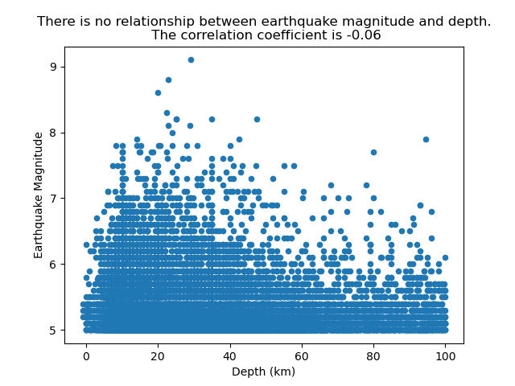
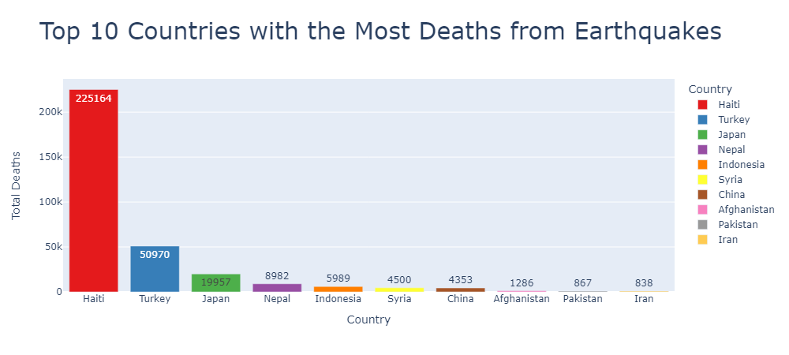

# Earthquakes of 2010-2023
Analytics Bootcamp Project 1 Group 6

## Contributors
* Hazel 
* Ashrita
* Richard
* Ben

## List of Proposed Questions
When we were initially brainstorming ideas for this project, we came up with the following questions to investigate.

1.	Successfully retrieve earthquake data from various open API sources 
2.	Look at the distribution and spatial characteristics of the magnitudes of earthquakes. Is there any correlation between earthquake magnitude and depth? 
3.	Record the number of earthquakes across different countries and globally. Rank these countries by the number of earthquakes and through time. Analyse the spatial distribution of the number of earthquakes. 
4.	Investigate the frequency of earthquakes per month and year. Analyse this spatially - Richard
5.	Investigate what are the relationships between magnitude of earthquake and causality rates and determine which countries are most affected. Is there a relationship between causality rates and a countries economic status? 
6.	*Stretch Question*: Is it possible to correlate tidal fluctuations with earthquake occurrence?

## Sources of Data
- Earthquake data: https://earthquake.usgs.gov/fdsnws/event/1/
- Earthquake death toll data: https://ourworldindata.org/natural-disasters
- Country shape files for country polygons and country metadata on GDP and economic status: https://www.naturalearthdata.com/downloads/10m-cultural-vectors/10m-admin-0-countries/

## Setup
It is strongly recommended to use the conda-forge channel with `conda config --add channels conda-forge`.

To run the notebooks in this project please use the yaml file `environment_requirements.yaml` for install with the command `conda env create -f environment_requirements.yml`. 

# Analysis of Data

## Data Retrieval

### Earthquake Data

### Country Data

## Assumptions and Filters
To reduce the size of the dataset, we’ve needed to filter out earthquakes from the data retrieval. We used the following:
- restricting earthquake magnitude to greater or equal to 5 
- retrieving data from 2010-2023
- filtering out earthquakes with a recorded depth of greater than 100km

## Analysis of Earthquake counts Per Country

## Analysis of Earthquake Magnitude and Depth

Most of earthquakes from 2010 to 2023 are between 5 and 6 magnitude
Most frequent occurrence of earthquakes between 2010 and 2023 are in a depth of below 20 km.​ Earthquakes with the depth of 20 and 40 km and 40 and 60 km occurred less.

 There is no significant relationship between earthquake magnitude and depth since the correlation coefficient is -0.06.

 

 # Analysis of Earthquake magnitudes

 Ranking magnitudes by top 20 countries are displayed.

 

 They are in accordance with the maps of most maximum magnitude earthquakes.

 

 

 ## Analysis of Earthquake Impact

This repository contains visualisations based on earthquake data, focusing on the impact of earthquakes on human lives and economic damages. The visualisations cover the period from 2010 to 2023.

### Choropleth Map: Total Deaths by Country

Below is a choropleth map visualising the total deaths caused by earthquakes from 2010 to 2023. The color scheme conveys important information about the impact in each country:

- **Blue:** Signifies areas with no available data.
- **Shades of Pink:** Indicate countries where earthquakes occurred during the specified period. 

The intensity of the color represents the magnitude of the impact in each country.

 

#### Key Observations:

- **Japan:** Appears slightly pinker on the map, indicating a notable impact.
- **Turkey:** Shows a more orange color, reflecting a significant level of impact.
- **Haiti:** Marked with a very dark red color, signifying the highest number of deaths caused by earthquakes.

The visual representation on the map offers a comprehensive overview of earthquake occurrences worldwide, with the color variations providing insights into the magnitude of the impact in different regions.

### Top 10 Countries with the Most Deaths from Earthquakes

A bar chart illustrates the top 10 countries with the highest number of deaths from earthquakes during the specified period. Each bar represents the total deaths in a respective country.

 

#### Key Observations:

- **Haiti:** Emerged as the leader with around 225 thousand deaths.
- **Turkey:** Followed closely with 51 thousand deaths.
- **Japan:** Despite being a developed country, experienced a significant number of deaths.

The chart provides a visual representation of the impact of earthquakes on different countries, highlighting the variation in the number of casualties. The presence of developed countries like Japan in the top ranks emphasises the vulnerability of even well-prepared regions to the devastating effects of earthquakes.

### Relation between Deaths, Economic Damages, and Economic Status in Top 10 Countries

A scatter plot delves into the relationship between the number of deaths and the total economic damages caused by earthquakes as a share of GDP in the top 10 affected countries.

 

#### Key Observation:

- **Least Developed Regions:** Notably, the plot reveals that more economic damage, as a share of GDP, occurred in the least developed regions, such as Haiti and Nepal.

### People Affected, Deaths, and Death to Affected Ratio in Top 10 Countries

A set of bar charts presents the impact of earthquakes on the top 10 countries in terms of people affected, deaths, and the death-to-affected ratio. The number of total people affected includes the count of deaths, injuries, and the number of people left homeless due to earthquakes.

 

#### Key Observations:

- **Haiti:** Representing one of the least developed regions, Haiti exhibits both the highest number of deaths and a notable death-to-affected ratio.
- **Turkey:** An emerging region experiences the second-highest number of deaths but maintains a relatively lower death-to-affected ratio, possibly correlated with its economic status and preparedness.
- **China:** Ranks second in total people affected, but its death-to-affected ratio remains notably low.
- **Japan:** Despite being a developed region, showcases the second-highest death-to-affected ratio due to the highest magnitude level recorded during the period, as illustrated previously.

These findings suggest a correlation between death rates and a country’s economic status, as well as the severity of earthquakes.

 ## Summary

### Key Findings

### Recommendations

