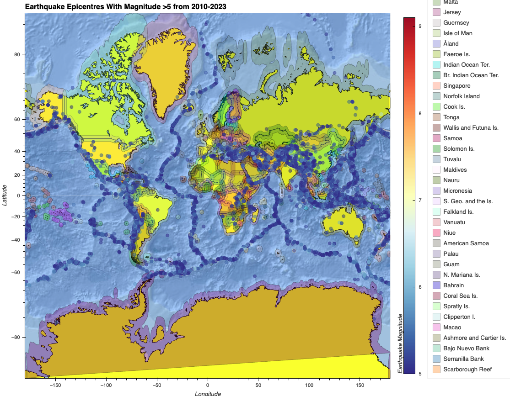
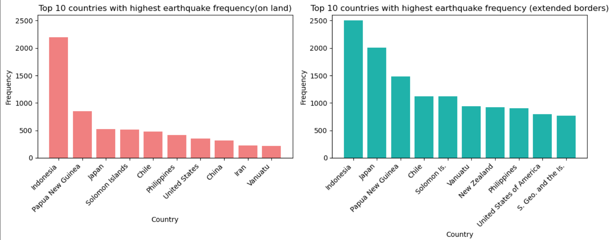
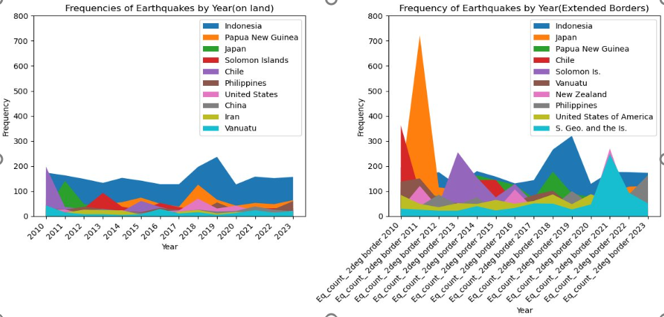
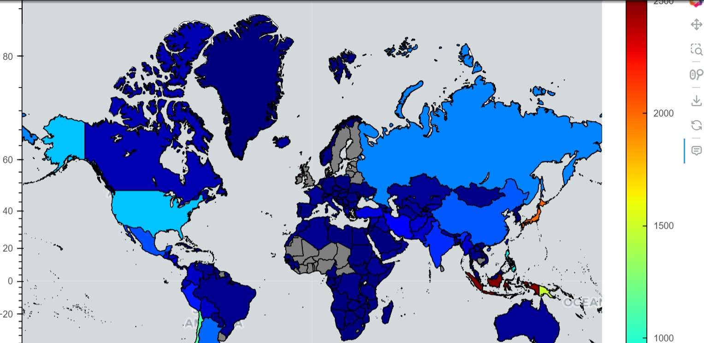
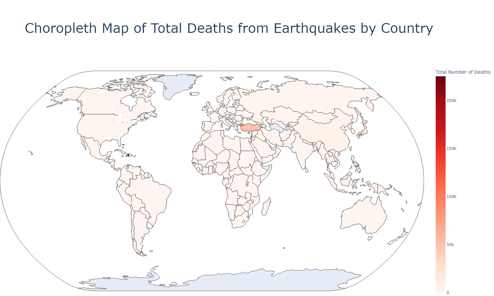

# Earthquakes of 2010-2023
Analytics Bootcamp Project 1 Group 6

## Contributors
* Hazel 
* Ashrita
* Richard
* Ben

## List of Proposed Questions
When we were initially brainstorming ideas for this project, we came up with the following questions to investigate.

1.	Successfully retrieve earthquake data from various open API sources 
2.	Look at the distribution and spatial characteristics of the magnitudes of earthquakes. Is there any correlation between earthquake magnitude and depth? 
3.	Record the number of earthquakes across different countries and globally. Rank these countries by the number of earthquakes and through time. Analyse the spatial distribution of the number of earthquakes. 
4.	Investigate the frequency of earthquakes per month and year. Analyse this spatially
5.	Investigate what are the relationships between magnitude of earthquake and causality rates and determine which countries are most affected. Is there a relationship between causality rates and a countries economic status? 
6.	*Stretch Question*: Is it possible to correlate tidal fluctuations with earthquake occurrence?

## Sources of Data
- Earthquake data: https://earthquake.usgs.gov/fdsnws/event/1/
- Earthquake death toll data: https://ourworldindata.org/natural-disasters
- Country shape files for country polygons and country metadata on GDP and economic status: https://www.naturalearthdata.com/downloads/10m-cultural-vectors/10m-admin-0-countries/

## Setup
It is strongly recommended to use the conda-forge channel with `conda config --add channels conda-forge`.

To run the notebooks in this project please use the yaml file `environment_requirements.yaml` for install with the command `conda env create -f environment_requirements.yml`. 

# Analysis of Data

### Data Location
- During the course of the project, any output datafiles from API extraction or dataframe generation are kept in the `/output_data/` directory.
- Additional datasets from "Our World in Data" and "Natural Earth Data" is stored in the `/input_data/` directory.
- Any images used in presenations or this README are located in the `/images/` directory.
- Additional functions that were used repeatedly or to improve code readability through the project are stored in the `project_modules.py` file.

### Assumptions and Filters
To reduce the size of the dataset, we’ve needed to filter out earthquakes from the data retrieval. We used the following:
- restricting earthquake magnitude to greater or equal to 5 
- retrieving data from 2010-2023
- filtering out earthquakes with a recorded depth of greater than 100km

## Data Retrieval

### Earthquake Data Retrieval Through USGS API  

The scripts used in the earthquake data retrieval are found in the notebook `generate_dataset.ipynb`. Additional notes of the individual steps taken to retrieve the earthquake data is found this notebook.

It was decided to break the API requests into geo-bins and monthly increments from 2010-2023 to provide monthly save points if an inevitable connection issues. An example of the 10 degree bins are shown below.

 

It should be noted that in the process of generating this dataset, the *GeoPy* Python module was used to geolocate the country where the earthquake epicentre was located. If no country was found, it is assumed to be offshore. If GeoPy could threw an `AttributeError`, an error was put in place of country. 

### Viewing Data

Combining the monthly earthquake outputs in csv file outputs from the USGS data retrieval are found in the notebook `view_datasets.ipynb`. The combined and cleaned up dataset is in 2 formats, csv and shapefile (shp) with the name `earthquakes_2010_2023` in the `output_data` subdirectory.

During the earthquake data retrieval process via GeoPy, a country error was printed in the `country` column of the full dataset 28 times. A successful effort was to retry the GeoPy module for those particular earthquakes.

Upon viewing the earthquakes in mapview with `hvplot`, it was noted that some major earthquakes were not being captured that were nearby certain countries and did have an effect on that country. Examples of this are the 2011 Japan earthquake and the 2023 Syrian earthquake where Turkey was also heavily impacted. Therefore a buffered country border was with 2 degrees (~220km) was generated around each country to capture these nearby earthquakes. This procedure was done with *GeoPandas*.

The figure below visualises all the earthquake epicentres along with the extended (buffered) borders. 

## Analysis of Earthquake counts Per Country
To perform this analysis, we filtered the data into 2 parts i.e., earthquakes happened on land and earthquakes happened on extended borders within 2 degrees, can be on land or in the ocean.
The below image gives the clear picture of land and extended borders

**Total number of earthquakes on land : 8124**

**Total number of earthquakes including extended borders : 24161**

### Top 10 countries with highest frequency of earthquakes​

Below image shows the top_10 countries with highest earthquake frequency both on land and inclusive of extended borders. Needless to say, Indonesia is the country with highest earthquake frequency followed by Japan and Papua New Guinea.
The position of the countries might have altered a bit but there is no significant change in the list of top_10 countries.

### Highest frequency of earthquakes by year

Below image shows the earthquake frequency of each country on a yearly basis starting from 2010 – 2023.
1st plot is the area graph of top_10 countries and the trend of the earthquakes on land and 2nd plot shows the trend of earthquakes including extended borders

### Spatial view of the earthquakes frequency

In the below image, the countries highlighed in red, orange, yellow are the ones with highest earthquake frequency.

## Analysis of Earthquake Magnitude and Depth
The analysis of earthquake magnitude and generated figures are available in the `earthquakes_magnitude_analysis_ben.ipynb`.

Most of earthquakes from 2010 to 2023 are between 5 and 6 magnitude.
Most frequent occurrence of earthquakes between 2010 and 2023 are in a depth of below 20 km.​ Earthquakes with the depth of 20 and 40 km and 40 and 60 km occurred less.
Both of the images skewed to the left of the graphs.

 #There is no significant relationship between earthquake magnitude and depth since the correlation coefficient is -0.06.

 
 
 Ranking magnitudes by top 20 countries are displayed.Japan ranked first in the earthquake magnitude and a strong earthquake in 2011 resulted in a tsunami and damage a nuclear plant in Fukushima. Chile and Argentina ranked 2nd and 3rd int the magnitude of earthquake. US and Peru are also in top 5 rankings of earthquake magnitude. They are close to the ring of fire on the Pacific rim.

 

 The findings above are also supported by the maps of most maximum magnitude of earthquakes. Top countries are usually on the rim of different plates where earth movements are active.

 

 

 ## Earthquake Casualty Analysis by Country

This repository contains visualisations based on earthquake data, focusing on the impact of earthquakes on human lives and economic damages. The visualisations cover the period from 2010 to 2023.

### Choropleth Map: Total Deaths by Country

The choropleth map displays the total number of deaths caused by earthquakes in different countries. The colour intensity represents the magnitude of the impact.

 

### Top 10 Countries with the Most Deaths from Earthquakes

A bar chart illustrating the top 10 countries with the highest number of deaths from earthquakes during the specified period. Each bar represents the total deaths in a country.

 

### Relation between Deaths, Economic Damages, and Economic Status in Top 10 Countries

A scatter plot illustrating the relationship between the number of deaths and the total economic damages caused by earthquakes as a share of GDP in the top 10 affected countries.

 

**Note:** Economic status is categorised and noted next to the country's name for better understanding. The data used for this visualisation is based on earthquake events recorded from 2010 to 2023.

### People Affected, Deaths, and Death to Affected Ratio in Top 10 Countries

A set of bar charts presenting the total number of deaths, the total number of people affected, and the death-to-affected ratio in the top 10 countries. Each chart provides insights into different aspects of the earthquake impact.

 

**Note:** The data used for these visualisations is based on earthquake events recorded from 2010 to 2023. The analysis aims to provide a comprehensive overview of the human and economic damages of earthquakes during this period.

 ## Summary

### Key Findings
- We were able to successfully use the USGS API interface to retrieve >20000 earthquakes from 2010 to 2023
- We were successfully able to capture the number of earthquakes across different countries. We ranked these countries by the number of earthquakes and through space & time. We also used an extended boundary of countries to catch earthquakes nearby to other countries which could impact that country
- We observed the left skewedness of earthquake magnitude and depth & found that there were no correlations between depth and magnitude
- We observed the spatial distribution of maximum magnitude of earthquakes and ranked countries by largest earthquake magnitude experienced. 
- Effect of earthquakes:
    - We observed the countries that have the highest cumulative causality rates from earthquakes. 
    - We observed that poorly developed nations suffer greatest economic impact from earthquakes. 
    - The death-to-affected ratio may be influenced to a country’s economic status (preparedness). The Japan outlier suggests that the earthquake magnitude also has a role to play
  
### Recommendations
- Further investigate the link between tidal fluctuations and earthquake occurrence
- Broaden the filters out of magnitude and depth

